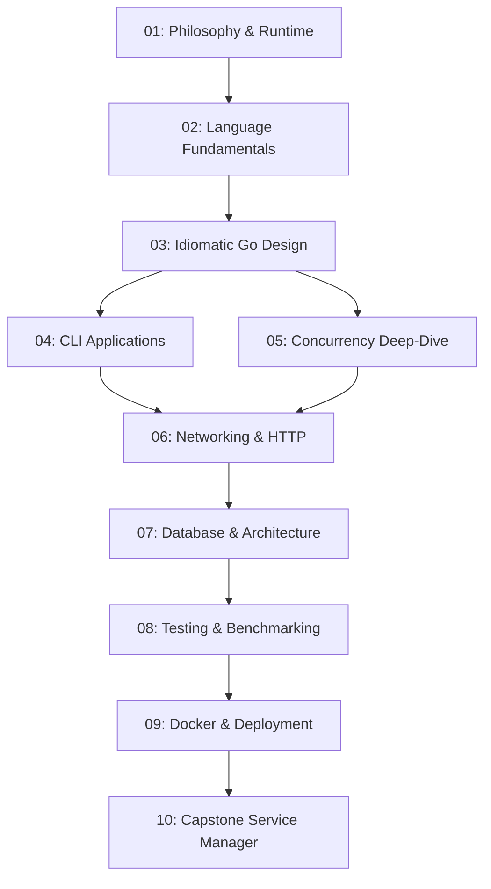

# Practical Go Engineering: Zero to Production

Welcome to the **Practical Go Engineering Training Course**. This curriculum is built directly from [go-learning-roadmap.md](./go-learning-roadmap.md). It transforms the learning journey into structured, domain-focused modules complete with conceptual foundations, internal runtime behavior, idiomatic designs, runnable code, automated tests, exercises, and production-grade projects.

---

## Curriculum Navigation



| Module | Core Concepts & Systems Covered | Key Deliverable / Project |
| :--- | :--- | :--- |
| [**01: Philosophy & Runtime**](./01-philosophy-and-runtime/) | Compilation model, GC (tri-color mark-sweep), Stack vs Heap, Escape Analysis, Zero Values | Memory & escape analysis demo (`memory_and_escape.go`) |
| [**02: Language Fundamentals**](./02-language-fundamentals/) | Syntax, Control flow, Defer, Slices & capacity doubling, Maps, Structs, Pointers | 5 Progressive Exercises (Temp Converter, Log Counter, Word Frequency, Contact Manager, Config Parser) |
| [**03: Idiomatic Go Design**](./03-idiomatic-go-design/) | Value/Pointer receivers, Small interfaces, Composition over inheritance, Error wrapping (`%w`) | Reusable `config` library with table-driven tests |
| [**04: CLI Applications**](./04-cli-applications/) | Flags, stdin/stdout, JSON streaming, OS signals, Layered Clean Architecture | `gomanager` CLI task management tool |
| [**05: Concurrency Deep-Dive**](./05-concurrency-deep-dive/) | Goroutines (GMP scheduler), Channels, `sync` primitives, `context` propagation, Leak detection | Concurrent File Processor with worker pools & progress tracking |
| [**06: Networking & HTTP**](./06-networking-and-http/) | TCP sockets, `net/http` standard library, Go 1.22+ routing, Middleware chaining, Graceful shutdown | Production REST API with unit & handler tests |
| [**07: Database & Architecture**](./07-database-and-architecture/) | `database/sql`, PostgreSQL, Connection pooling, ACID transactions, Repository pattern | Layered PostgreSQL REST API with migrations |
| [**08: Testing & Benchmarking**](./08-testing-and-benchmarking/) | Table-driven tests, `httptest`, Interface-based mocks, Benchmarks (`b.ReportAllocs`), Profiling | Testing suite & performance analysis |
| [**09: Docker & Deployment**](./09-docker-and-deployment/) | Multi-stage Docker builds, Alpine/Scratch, Docker Compose, Linux systemd service | Containerized multi-container stack & systemd guide |
| [**10: Capstone Service Manager**](./10-capstone-service-manager/) | End-to-end production architecture: CLI + HTTP Server + Background Workers + Persistence | `Go Service Manager (GSM)` production system |

---

## Getting Started: Environment Setup

### 1. Installing Go
- **Windows**:
  1. Download the installer from [golang.org/dl](https://golang.org/dl/).
  2. Run the `.msi` installer.
  3. Verify in PowerShell:
     ```powershell
     go version
     ```
  4. Ensure your environment variables are configured:
     - `GOROOT`: Installation directory (default: `C:\Program Files\Go`)
     - `GOPATH`: Workspace directory (default: `%USERPROFILE%\go`)
     - `PATH`: Must include `C:\Program Files\Go\bin` and `%USERPROFILE%\go\bin`

- **Linux / macOS**:
  ```bash
  # Linux
  curl -fsSL https://go.dev/dl/go1.22.6.linux-amd64.tar.gz | sudo tar -C /usr/local -xz
  export PATH=$PATH:/usr/local/go/bin
  ```

### 2. Recommended Editor Configuration (VS Code / Antigravity)
Install the official **Go** extension (`golang.Go`). It activates:
- **`gopls`**: The official Go Language Server (autocomplete, hover documentation, jump to definition).
- **`staticcheck`**: Industry-standard linter.
- Auto-formatting on save (`goimports` / `gofmt`).

### 3. How to Run Code in this Repository
This repository is initialized as a single root Go module: `golang_training`.

To run any example:
```powershell
# Run a specific file
go run ./02-language-fundamentals/01_syntax_and_types/main.go

# Run tests across a module
go test -v ./03-idiomatic-go-design/mini-project-config-manager/...

# Run tests with the race detector enabled
go test -race ./05-concurrency-deep-dive/project-file-processor/...
```

---

## Standard Lesson Format

To ensure deep learning and technical mastery, each topic follows this standard 7-step sequence:
1. **Conceptual Foundation**: The core idea, why it exists, and when to use it.
2. **Internal Behavior**: Memory layout, runtime scheduler, compiler optimizations, or operating system interactions.
3. **Design Discussion**: Trade-offs, design constraints, and common anti-patterns.
4. **Pseudocode & Architecture**: High-level mental model before code.
5. **Implementation**: Idiomatic, complete, working Go code.
6. **Testing & Debugging**: How to validate, test corner cases, and diagnose issues.
7. **Understanding Check**: Targeted review questions and practical challenges.
